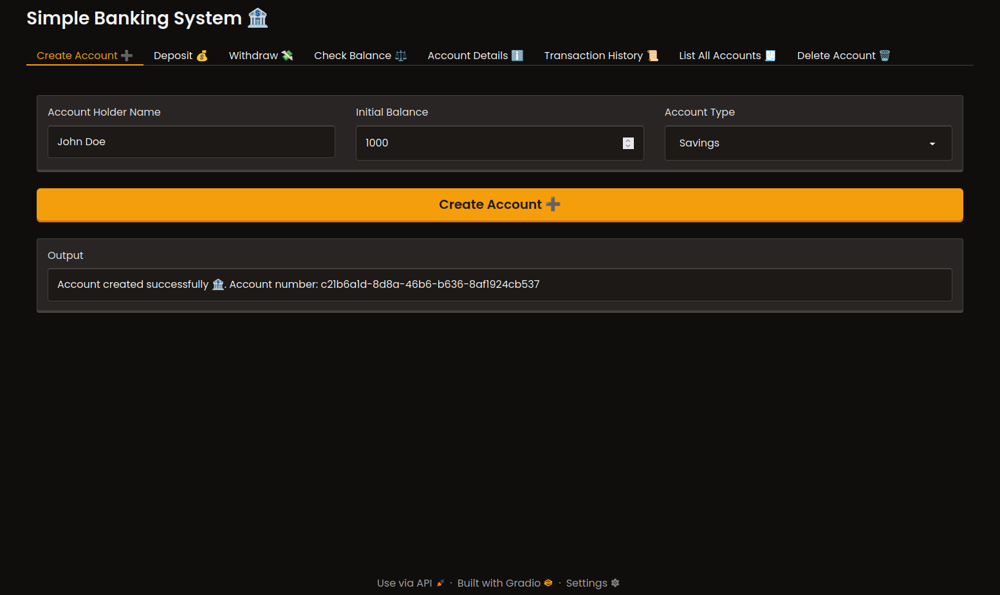

# Simple Banking System

This is a basic banking system application built with Python and Gradio. It provides a web interface to manage bank accounts.

## Features

*   Create new bank accounts.
*   Deposit funds.
*   Withdraw funds.
*   Check account balance.
*   View account details.
*   See transaction history.
*   List all accounts.
*   Delete accounts.

## Preview

## Prerequisites

*   Python 3.6+
*   Gradio library (`pip install gradio`)

## How to Run

1.  Save the Python code to a file (e.g., `app.py`).
2.  Open a terminal in the same folder.
3.  Run: `app.py`
4.  Open the provided URL in your browser.

## License
This project is licensed under the MIT License.
This project is part of a college assignment.
